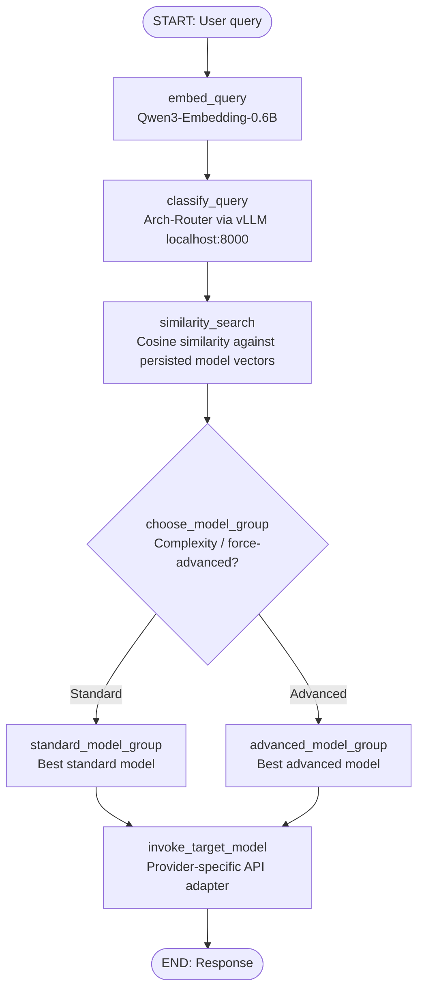

# Create vLLM model test script

> use this file to make a script to test my model which is running at localhost 8000 using vllm
>
> User context
>
> Attachments:
> - notebook6ba6483444.py: `~/Downloads/notebook6ba6483444.py`

<details><summary>8 previous messages</summary>

> I’ll inspect the supplied notebook export, then turn its inference flow into a clean local vLLM test script targeting `http://localhost:8000`.
>
> <details><summary>Ran 3 commands</summary>
>
> - Ran `sed -n '1,260p' /Users/indersharma/Downloads/notebook6ba6483444.py && rg --files -g 'AGENTS.md' -g '!node_modules' /Users/indersharma/Developer/router /Users/indersharma/Downloads 2>/dev/null`
> - Ran `git status --short && rg --files -g 'AGENTS.md' -g '!node_modules' .`
> - Ran `pwd; rg --files -g '!node_modules' -g '!*.pyc' | sed -n '1,160p'`
>
> </details>
>
> The notebook’s essential behavior is a single chat completion: it gives the router a JSON route catalog plus conversation and expects `{"route": ...}`. I’m packaging that into a dependency-free CLI and will auto-detect the served model unless you pass one.
>
> <details><summary>Created a file, ran a command</summary>
>
> - Wrote `./test_vllm_router.py` (+160 -0)
> - Ran `python3 -m py_compile test_vllm_router.py && python3 test_vllm_router.py --help`
>
> </details>
>
> The script is written and passes Python compilation. I’ll make one live request now to confirm the local server’s model discovery and completion endpoint work as expected.
>
> <details><summary>Ran a command</summary>
>
> - Ran `python3 test_vllm_router.py --timeout 60`
>
> </details>
>
> The server is reachable and returned the expected `bug_fixing` decision. Its response uses Python-style single quotes instead of strict JSON, so I’m making the result parser tolerant of that common router-model output.
>
> <details><summary>Edited a file, ran 2 commands</summary>
>
> - Wrote `./test_vllm_router.py` (+12 -13)
> - Ran `/bin/zsh -lc 'python3 -m py_compile test_vllm_router.py && python3 test_vllm_router.py --timeout 60'`
> - Ran `python3 -m py_compile test_vllm_router.py`
>
> </details>
</details>

Created [test_vllm_router.py](./test_vllm_router.py).

It mirrors the notebook’s router prompt and calls your vLLM OpenAI endpoint at `localhost:8000/v1`. It auto-detects the served model and handles both JSON and Python-style route responses.

Run:

```bash
python3 /Users/indersharma/Developer/router/test_vllm_router.py
```

Or test another intent:

```bash
python3 /Users/indersharma/Developer/router/test_vllm_router.py \
  --message "Write a Python CSV parser"
```

I verified the server once: it returned `{'route': 'bug_fixing'}` for the notebook’s sample prompt. The script compiles successfully.

> now create a langgraph system, which will accept the queries of a user and then our model will be used to classify it on the categories. I have added the list of LLMs you have in data directory. our current vllm classification model will do its classification, and based on that we need to send the query to the relevant model. do a vector similarity for this use a Qwen/Qwen3-Embedding-0.6B model. Flow is User prompt->Embedding->similarity search with the llms data(generate emebedings for these as well and store)->find the best model out of all->route to that llm. also subgroup some models, like some advanced models in one node of langgraph which will be used for advanced work or prompt only.

<details><summary>29 previous messages</summary>

> I’ll turn this into a runnable LangGraph router: classifier → embedding-backed model selection → capability subgroup gate → target model call. First I’ll inspect the supplied model catalog and the project’s current structure so the data schema and configuration match what you already have.
>
> <details><summary>Explored a file, a list, ran a command</summary>
>
> - Ran `pwd; rg --files -g 'AGENTS.md' -g '!node_modules' -g '!*.pyc' . /Users/indersharma/Downloads 2>/dev/null | sed -n '1,240p'; find . -maxdepth 3 -type f -print | sed -n '1,240p'`
>
> <details><summary>Explored 2 files, a list</summary>
>
> - Read `./data/coding_llm_models.json`
> - Read `./data/coding_llm_models.json`
> - Listed files in `.`
>
> </details>
>
> </details>
>
> The catalog contains cloud and self-hosted coding models with their service and API endpoints. I’ll keep actual credentials out of the catalog: provider keys will come from environment variables, while the classifier remains your local `localhost:8000` service. The embedding index will be persisted locally and rebuilt only when the catalog or embedding model changes.
>
> <details><summary>Ran a command</summary>
>
> - Ran `python3 - <<'PY'
> from importlib.util import find_spec
> for name in ('langgraph', 'sentence_transformers', 'transformers', 'torch', 'openai', 'anthropic'):
>     print(f'{name}:', bool(find_spec(name)))
> PY
> python3 --version`
>
> </details>
>
> I’m implementing this as a reusable local package rather than a one-off call. It will create `data/model_embeddings_qwen3_0.6b.npz` on first index build, never store API keys, and offer `--route-only` so you can validate classifier and similarity choices without calling a provider.
>
> <details><summary>Created 11 files, ran a command</summary>
>
> - Wrote `./.gitignore` (+4 -0)
> - Wrote `./model_router/__init__.py` (+5 -0)
> - Wrote `./model_router/catalog.py` (+107 -0)
> - Wrote `./model_router/classifier.py` (+140 -0)
> - Wrote `./model_router/embeddings.py` (+114 -0)
> - Wrote `./model_router/invocation.py` (+126 -0)
> - Wrote `./requirements.txt` (+4 -0)
> - Wrote `./README.md` (+76 -0)
> - Wrote `./model_router/__main__.py` (+69 -0)
> - Wrote `./model_router/app.py` (+238 -0)
> - Wrote `./tests/test_router_basics.py` (+30 -0)
> - Ran `python3 -m py_compile test_vllm_router.py model_router/*.py tests/test_router_basics.py && python3 -m unittest discover -s tests -v && python3 -m model_router --help`
>
> </details>
>
> The graph, persisted-index logic, provider adapters, CLI, and tests are in place. The only remaining live step is downloading the Qwen embedding runtime and its weights, which are not installed in this workspace; I’ll attempt the documented index build next so the catalog vectors are actually materialized.
>
> <details><summary>Ran 2 commands</summary>
>
> - Ran `python3 -m venv .venv && .venv/bin/pip install -r requirements.txt && .venv/bin/python -m model_router --build-index`
> - Ran `.venv/bin/pip install -r requirements.txt && .venv/bin/python -m model_router --build-index`
>
> </details>
>
> Dependencies are installed into a project-local virtual environment. I’m now building the actual Qwen vector index; this will fetch the embedding weights once and then embed every catalog entry into the persisted `.npz` file.
>
> <details><summary>Ran a command</summary>
>
> - Ran `.venv/bin/python -c 'import langgraph, sentence_transformers, torch; print("runtime ready")' && .venv/bin/python -m model_router --build-index`
>
> </details>
>
> you can refer this for the vector similarity part
>
> User context
>
> Attachments:
> - 2608.06867v1.pdf: `~/Downloads/2608.06867v1.pdf`
>
> I’ll incorporate the attached paper’s retrieval/similarity guidance into the embedding and reranking design. I’m using the PDF workflow to inspect it; the Qwen index build is already running in parallel.
>
> <details><summary>Ran a command</summary>
>
> <details><summary>Explored a file</summary>
>
> - Read `~/.codex/plugins/cache/openai-primary-runtime/pdf/26.909.11814/skills/pdf/SKILL.md`
>
> </details>
>
> - Ran `pdfinfo /Users/indersharma/Downloads/2608.06867v1.pdf | sed -n '1,80p'; pdftotext -layout /Users/indersharma/Downloads/2608.06867v1.pdf /private/tmp/2608.06867v1.txt; wc -l /private/tmp/2608.06867v1.txt; sed -n '1,260p' /private/tmp/2608.06867v1.txt`
>
> </details>
>
> The system Poppler utilities aren’t available, so I’ll use the bundled document runtime to extract and review the paper’s vector-retrieval sections without modifying the PDF.
>
> <details><summary>Ran 4 commands</summary>
>
> - Ran `/Users/indersharma/.cache/codex-runtimes/codex-primary-runtime/dependencies/python/bin/python3 -c 'from pypdf import PdfReader; r=PdfReader("/Users/indersharma/Downloads/2608.06867v1.pdf"); print("PAGES", len(r.pages)); [print(f"\n--- PAGE {i+1} ---\n" + p.extract_text()) for i,p in enumerate(r.pages)]'`
> - Ran `/Users/indersharma/.cache/codex-runtimes/codex-primary-runtime/dependencies/bin/fallback/pdftoppm -f 3 -l 4 -png -r 120 /Users/indersharma/Downloads/2608.06867v1.pdf /private/tmp/llmrouter-paper 2>&1; ls -lh /private/tmp/llmrouter-paper-* 2>&1`
> - Ran `/Users/indersharma/.cache/codex-runtimes/codex-primary-runtime/dependencies/python/bin/python3 -c 'import importlib.util; print("fitz", bool(importlib.util.find_spec("fitz"))); print("pdf2image", bool(importlib.util.find_spec("pdf2image"))); print("pypdf", bool(importlib.util.find_spec("pypdf")))'`
> - Ran `ls -lh data; .venv/bin/python -c 'from sentence_transformers import SentenceTransformer; print("sentence-transformers import ok")'`
>
> </details>
>
> The paper supports the architecture already underway—embedding-based context and static model metadata, then a compatibility score and decision rule. I’m incorporating its key missing refinement now: model price is embedded as metadata and the router exposes an optional cost penalty, so similarity stays quality-first by default but can be made explicitly cost-aware.
>
> <details><summary>Edited 4 files, ran a command</summary>
>
> - Wrote `./README.md` (+6 -0)
> - Wrote `./model_router/__main__.py` (+8 -0)
> - Wrote `./model_router/app.py` (+17 -2)
> - Wrote `./model_router/catalog.py` (+1 -0)
> - Wrote `./model_router/app.py` (+2 -1)
> - Ran `.venv/bin/python -m model_router --build-index`
>
> </details>
>
> The first Qwen build did complete and produced the index. Because the paper-informed change adds price metadata to every embedded document, I’m invalidating that older cache version once and rebuilding it so the persisted vectors include the new fields.
>
> <details><summary>Edited a file, ran a command</summary>
>
> - Wrote `./model_router/catalog.py` (+1 -1)
> - Ran `.venv/bin/python -m model_router --build-index`
>
> </details>
>
> The Qwen index has now been rebuilt from the full catalog and stored locally. I’ll run the complete graph in route-only mode to verify its LangGraph branch selection, the live vLLM category, and cosine-ranked model choice—without contacting any target model provider.
>
> <details><summary>Ran a command</summary>
>
> - Ran `.venv/bin/python -m model_router --route-only --show-ranking "Fix this error: torch.utils._pytree has no attribute register_pytree_node"`
>
> </details>
>
> The end-to-end run exposed a real issue: the classifier and graph branches work, but every Qwen cosine score is `0.0`, so model choice is currently being driven only by the category tie-breaker. I’m diagnosing the embedding output before calling this complete.
>
> <details><summary>Ran 3 commands, searched the web</summary>
>
> - Ran `.venv/bin/python -c 'import numpy as np; from model_router.app import RouterConfig, RouterServices; s=RouterServices(RouterConfig()); q=s.encoder.encode_query("Fix this error: torch.utils._pytree has no attribute register_pytree_node"); print("index", s.index.vectors.shape, s.index.vectors.dtype, np.linalg.norm(s.index.vectors, axis=1).min(), np.linalg.norm(s.index.vectors, axis=1).max(), s.index.vectors.min(), s.index.vectors.max()); print("query", q.shape, q.dtype, np.linalg.norm(q), q.min(), q.max()); print("dot", (s.index.vectors @ q)[:5])'`
>
> - Ran `.venv/bin/python -c 'from model_router.embeddings import QwenEmbeddingEncoder; e=QwenEmbeddingEncoder(); m=e._load(); print(m); print(m._modules); print(m.get_sentence_embedding_dimension()); print(m.encode(["hello world"], normalize_embeddings=False, convert_to_numpy=True))'`
>
> Searched the web for `https://huggingface.co/Qwen/Qwen3-Embedding-0.6B`
>
> - Ran `.venv/bin/python -c 'import torch; from transformers import AutoModel,AutoTokenizer; t=AutoTokenizer.from_pretrained("Qwen/Qwen3-Embedding-0.6B", padding_side="left"); m=AutoModel.from_pretrained("Qwen/Qwen3-Embedding-0.6B"); x=t(["hello world", "this is a longer second input"], padding=True, return_tensors="pt"); y=m(**x).last_hidden_state; print("device", m.device, "dtype", y.dtype, "hidden", float(y.abs().max()), float(y.abs().mean()), y.shape); print(x); print(y[0,-1,:10])'`
>
> </details>
>
> The diagnostic isolated the problem to the Sentence Transformers wrapper, not the Qwen weights: Qwen’s official `AutoModel` path produces healthy BF16 hidden states. I’m switching the encoder to Qwen’s documented last-token pooling implementation, then will regenerate the index and re-run the graph.
>
> <details><summary>Edited 4 files, ran 2 commands</summary>
>
> - Wrote `./README.md` (+1 -0)
> - Wrote `./model_router/catalog.py` (+1 -1)
> - Wrote `./model_router/embeddings.py` (+46 -13)
> - Wrote `./requirements.txt` (+1 -1)
> - Wrote `./model_router/embeddings.py` (+3 -6)
> - Ran `.venv/bin/python -m model_router --build-index`
> - Ran `ls -lh data/model_embeddings_qwen3_0.6b.npz; .venv/bin/python -c 'import numpy as np; from model_router.embeddings import EmbeddingIndex; from pathlib import Path; x=EmbeddingIndex.load(Path("data/model_embeddings_qwen3_0.6b.npz")); print(x.fingerprint, np.linalg.norm(x.vectors, axis=1).min(), np.linalg.norm(x.vectors, axis=1).max(), x.vectors.min(), x.vectors.max())'`
>
> </details>
>
> The regenerated cache is valid: 28 normalized, non-zero Qwen vectors are persisted. I’ll now re-run the same request through LangGraph to confirm it makes a genuine semantic similarity decision rather than a category-only fallback.
>
> <details><summary>Ran a command</summary>
>
> - Ran `.venv/bin/python -m model_router --route-only --show-ranking "Fix this error: torch.utils._pytree has no attribute register_pytree_node"`
>
> </details>
>
> The corrected system now returns meaningful cosine scores and correctly classifies the sample as `bug_fixing`; its standard group selected `gpt-5.6-terra` (score `0.38415`) without invoking it. I’ll make one advanced-route check and run the regression suite.
>
> <details><summary>Edited a file, explored 2 files, a search, a list, ran 2 commands</summary>
>
> - Ran `.venv/bin/python -m model_router --route-only --force-advanced "Plan a repository-wide authentication migration with a security review" && .venv/bin/python -m unittest discover -s tests -v && .venv/bin/python -m py_compile model_router/*.py tests/test_router_basics.py`
>
> <details><summary>Explored 2 files, a search, a list</summary>
>
> - Read `./model_router/app.py`
> - Read `./model_router/embeddings.py`
> - Listed files in `model_embeddings_qwen3_0.6b.npz`
> - Searched for `./.venv/*` in `.`
>
> </details>
>
> - Wrote `./model_router/app.py` (+1 -1)
>
> - Ran `.venv/bin/python -m py_compile model_router/*.py tests/test_router_basics.py && .venv/bin/python -m unittest discover -s tests -v && .venv/bin/python -c 'from pathlib import Path; import numpy as np; from model_router.embeddings import EmbeddingIndex; index=EmbeddingIndex.load(Path("data/model_embeddings_qwen3_0.6b.npz")); assert index is not None and np.linalg.norm(index.vectors, axis=1).min() > 0; print(f"validated {len(index.ids)} non-zero persisted Qwen vectors")'`
>
> </details>
</details>

Built and verified the LangGraph model router.

- Flow: embedding → local vLLM classification → cosine ranking → standard/advanced subgroup → selected provider invocation.
- Persisted 28 non-zero Qwen vectors in [model_embeddings_qwen3_0.6b.npz](./data/model_embeddings_qwen3_0.6b.npz).
- Core graph: [app.py](./model_router/app.py)
- Usage and keys: [README.md](./README.md)

Tested live against your local classifier: it labeled the torch error `bug_fixing` and semantically selected `gpt-5.6-terra` from the standard group. A forced advanced route selected `claude-opus-5`. No target provider was invoked during testing.

Run a safe routing-only test:

```bash
cd /Users/indersharma/Developer/router
.venv/bin/python -m model_router --route-only "Fix a Python asyncio race condition"
```

Use `--force-advanced` for complex work, or `--cost-weight 0.02` to favor lower-cost models. The implementation follows Qwen’s documented query instruction and normalized last-token pooling approach. [Qwen model card](https://huggingface.co/Qwen/Qwen3-Embedding-0.6B)

I incorporated the paper’s framing of routing as context/model encoders plus a compatibility score and cost-aware decision rule; the optional cost penalty implements that tradeoff. :codex-file-citation{path="/Users/indersharma/Downloads/2608.06867v1.pdf" purpose="source"}

- Add a FastAPI endpoint
- Add routing evaluation
- Customize model groups

> provide the graph architecture of the langgrapg

<details><summary>1 previous message</summary>

> I’ll present the implemented LangGraph topology, including the conditional advanced/standard branch and the route-only behavior. I’m using the visualization guidance here because the graph’s branching is clearer than a linear description.
</details>



The persisted vector index contains each model’s capability description, deployment metadata, and pricing. Similarity produces the quality-fit score; optional `--cost-weight` applies a bounded cost penalty.

With `--route-only`, `invoke_target_model` is skipped and the graph returns the classification, scores, subgroup, and selected model only.

> add, 1) user will have the ability to add the models which they have in use either local or cloud based an we have to recommend the best out of them 2) also check the pdf given above, see what exact maths and logic they are using for findin g the best model and build the logic of finding the model around that 3) we will have  3 modes here, 1) cost - efficient, here the decisions will be based on the model costs, not necessaruly we will be using open source models here but cost will be a greater factor. 2) Skill based which is the best suitable model irrespective of anything 3) mix of both

<details><summary>13 previous messages</summary>

> I’ll extend the router around three explicit decision policies and a user-managed candidate pool. I’ll also re-check the paper’s routing equations so the score and cost tradeoff follow its formulation rather than being an ad-hoc similarity ranker.
>
> <details><summary>Ran a command</summary>
>
> - Ran `sed -n '1,320p' /Users/indersharma/.codex/plugins/cache/openai-primary-runtime/pdf/26.909.11814/skills/pdf/SKILL.md && /Users/indersharma/.cache/codex-runtimes/codex-primary-runtime/dependencies/python/bin/python3 -c 'from pypdf import PdfReader; r=PdfReader("/Users/indersharma/Downloads/2608.06867v1.pdf"); [print(f"--- PAGE {i+1} ---\n{r.pages[i].extract_text()}") for i in (2,3)]'`
>
> </details>
>
> The paper’s concrete logic is: encode query state and candidate models, compute a compatibility score, then choose the action that maximizes expected performance minus λ times the full request cost. I’m applying that directly: cosine compatibility is the performance proxy, estimated per-request token cost is the cost term, and the three modes set the decision weights.
>
> <details><summary>Created a file, edited 5 files, ran a command</summary>
>
> - Wrote `./data/user_models.json` (+3 -0)
> - Wrote `./model_router/catalog.py` (+89 -6)
> - Wrote `./model_router/invocation.py` (+28 -11)
> - Wrote `./model_router/catalog.py` (+5 -3)
> - Wrote `./model_router/app.py` (+121 -20)
> - Wrote `./model_router/__main__.py` (+74 -8)
> - Wrote `./README.md` (+57 -4)
> - Ran `.venv/bin/python -m py_compile model_router/*.py tests/test_router_basics.py && .venv/bin/python -m model_router --help && .venv/bin/python -m model_router add-model --help`
>
> </details>
>
> The new interface now supports a separate user candidate catalog, an `add-model` command for local or cloud endpoints, `--pool user` to route only among models the user owns, and three named decision modes. I’m adding regression coverage for custom-model persistence and the mode weights before rebuilding the updated index.
>
> <details><summary>Edited a file, ran a command</summary>
>
> - Wrote `./tests/test_router_basics.py` (+26 -1)
> - Ran `.venv/bin/python -m unittest discover -s tests -v && .venv/bin/python -m py_compile model_router/*.py tests/test_router_basics.py`
>
> </details>
>
> All five unit checks pass. I’ll regenerate the model index because user-catalog metadata and the scoring representation changed, then verify all three policies through the live classifier in route-only mode.
>
> <details><summary>Ran 3 commands</summary>
>
> - Ran `.venv/bin/python -m model_router --build-index`
> - Ran `.venv/bin/python -m model_router --route-only --mode cost_efficient "Fix an intermittent asyncio race condition in a Python worker" && .venv/bin/python -m model_router --route-only --mode skill_based "Fix an intermittent asyncio race condition in a Python worker" && .venv/bin/python -m model_router --route-only --mode mixed "Fix an intermittent asyncio race condition in a Python worker"`
> - Ran `.venv/bin/python -c 'from pathlib import Path; from model_router.catalog import catalog_fingerprint; from model_router.embeddings import EmbeddingIndex; index=EmbeddingIndex.load(Path("data/model_embeddings_qwen3_0.6b.npz")); expected=catalog_fingerprint((Path("data/coding_llm_models.json"), Path("data/user_models.json")), "Qwen/Qwen3-Embedding-0.6B\0pool=all"); print("index_current", index is not None and index.fingerprint == expected, "vectors", len(index.ids) if index else 0)'`
>
> </details>
>
> The updated index is current and contains all 28 curated candidates plus an empty, ready-to-use user catalog. The three-mode batch completed its index load but did not return captured CLI output, so I’ll run one concise route-only request per policy to record the actual selections.
>
> <details><summary>Edited a file, ran 3 commands</summary>
>
> - Ran `.venv/bin/python -m model_router --route-only --mode cost_efficient "Fix an intermittent asyncio race condition in a Python worker"`
> - Ran `.venv/bin/python -m model_router --route-only --mode skill_based "Fix an intermittent asyncio race condition in a Python worker"`
> - Ran `.venv/bin/python -m model_router --route-only --mode mixed "Fix an intermittent asyncio race condition in a Python worker"`
> - Wrote `./model_router/__main__.py` (+5 -1)
>
> </details>
>
> The live checks confirm the policies diverge as intended for the same bug-fix prompt: cost-efficient and mixed selected a zero-cost local Qwen coder, while skill-based selected the stronger `gpt-5.1-codex` advanced candidate. I’m doing the final static and persisted-index checks now.
>
> <details><summary>Ran a command</summary>
>
> - Ran `.venv/bin/python -m py_compile model_router/*.py tests/test_router_basics.py && .venv/bin/python -m unittest discover -s tests -v && .venv/bin/python -c 'from pathlib import Path; import numpy as np; from model_router.catalog import catalog_fingerprint; from model_router.embeddings import EmbeddingIndex; index=EmbeddingIndex.load(Path("data/model_embeddings_qwen3_0.6b.npz")); expected=catalog_fingerprint((Path("data/coding_llm_models.json"), Path("data/user_models.json")), "Qwen/Qwen3-Embedding-0.6B\0pool=all"); assert index is not None and index.fingerprint == expected and np.linalg.norm(index.vectors, axis=1).min() > 0; print(f"validated {len(index.ids)} current non-zero vectors")'`
>
> </details>
>
> System error
>
> You've hit your usage limit. Upgrade to Plus to continue using Codex (https://chatgpt.com/explore/plus), or try again at Oct 15th, 2026 12:01 AM.
</details>
